```{r,echo=FALSE,warning=FALSE}
suppressPackageStartupMessages(
  {
  library(ggplot2)
  library(survival)
  library(survminer)
  library(gridExtra)
  library(dplyr)
  library(knitr)
  }
)
mycolors <- c("myred"="#f36569",
              "myorange"="#ff8831",
              "myyellow"="#ffc17f",
              "mygreen1"="#b3e19b",
              "mygreen2"="#6fb3a8",
              "myblue1"= "#a2d2e7",
              "myblue2"="#67a8cd",
              "mypurple"="#9a7fbd")
```

## Outline

::: incremental
1.  Phases of trials

2.  Phase I trials

    -   Aim: find a proper dose
    -   Commonly used outcomes: DLT, (sometimes) objective tumor response
    -   Design: 3+3, BOIN, CRM
    -   Sample size calculation
    -   Analysis: descriptive
:::

## Outline

3.  Phase II trials

    -   Aim: confirm safety, investigate preliminary efficacy
    -   Commonly used outcomes: objective tumor response, (sometimes) PFS, OS
    -   Design: single-arm, (sometimes) RCT
    -   Sample size calculation
    -   Analysis: chi-square test, logistic regression

4.  Phase III trials

    -   Aim: establish efficacy
    -   Commonly used outcomes: PFS, OS
    -   Design: RCT
    -   Sample size calculation
    -   Analysis: log-rank test, Kaplan-Meier curve, Cox model

## Outline

If time permits

5.  Related topics

    -   Types of censoring
    -   Multiple testing adjustment: interim analyis, co-primary endpoints, subgroup analysis
    -   Non-inferiority trials

Extra information can be found via the [red link]{.red-text} in this presentation

## 1. Phases of trials

[more at cancerresearchuk](https://www.cancerresearchuk.org/about-cancer/find-a-clinical-trial/what-clinical-trials-are/phases-of-clinical-trials)

{fig-align="center" width="100%"}

## Phase I trials: Aim

The aim of Phase I trials is to recommend a dose for further investigation in Phase II

-   Traditionally in chemotherapy, we often aim for the maximum tolerable dose (MTD)
    -   The highest dose with acceptable toxicity
    -   Underlying assumption: dose-toxicity closely parallels the dose-response curve

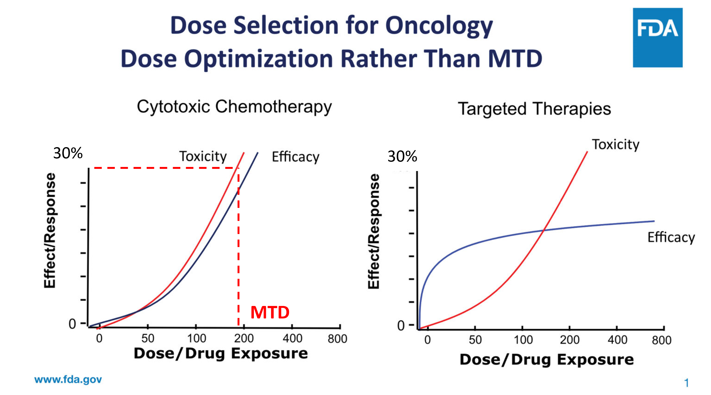{fig-align="center" width="70%"}

## Phase I trials: Aim

The aim of Phase I trials is to recommend a dose for further investigation in Phase II

-   With Immuno-/targeted therapies, there is a trend towards optimal biological dose
    -   The lowest dose associated with biological efficacy
    -   Earlier plateau of efficacy

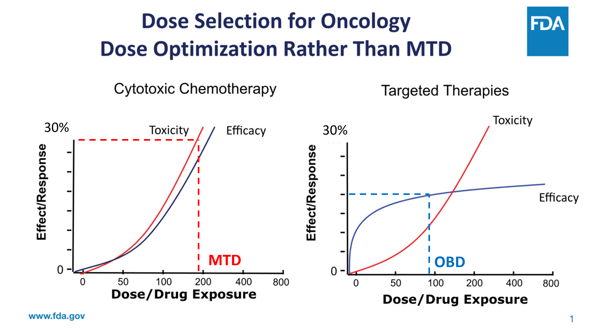{fig-align="center" width="70%"}

## Phase I trials: Outcome

### If the aim is MTD

-   The outcome is usually dose-limiting toxicity (DLT), which is binary (yes/no)
-   DLT is evaluated as follows
    -   All toxicity events are graded on a scale from 1 (minor) to 4 (severe) according to some criteria, e.g., Common Terminology Criteria for Adverse Events (CTCAE))
    -   Toxicity events that are severe enough are considered to be dose-limiting, e.g., grade 3--4 non-haematological, or grade 4 haematological toxicity
    -   Varies with each trial
    -   If a patient experiences any dose-limiting toxicity, she/he is considered to have a DLT event

### If the aim is OBD

-   The outcome also involves objective tumor response in addition to DLT

## Phase I trial: Design (focus on MTD)

### General scheme of a dose-finding design

-   Specify a target DLT rate (the highest toxicity we accept)
-   Select a handful of dose levels (3-8, median 5) to be investigated
-   Start from the lowest dose which is almost certainly safe
-   Escalate to the next dose if current dose appears safe, De-escalation to lower dose if current dose appears toxic

## Phase I trial: Design (focus on MTD)

### 3+3 Design

-   Commonly used, easy implementation
-   Drawback: statistically very inefficient
    -   Ignores dosage history other than previous cohort
    -   No target DLT rate, tends to be conservative (20%-25% DLT)

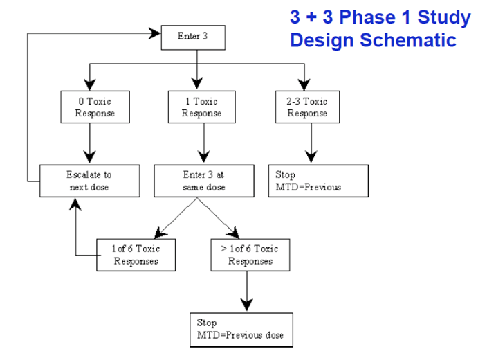{fig-align="center" width="50%"}

## Phase I trial: Design (focus on MTD)

### More efficient design: BOIN

-   A refinement of 3+3 design
    -   Use more refined decision rules than just "1 out of 3 patients experiencing DLT"
-   Can specify target DLT rate
-   Easy implementation: can be pre-tabulated!
    -   [Website](https://biostatistics.mdanderson.org/shinyapps/BOIN/) for BOIN design

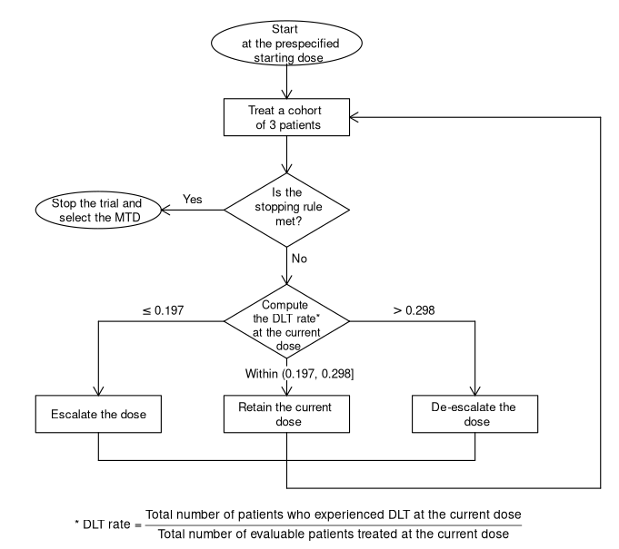{fig-align="center" width="40%"}

<!-- ## Phase I trial: Design (focus on MTD) -->

<!-- ### Model-based Design: CRM, EWOC -->

<!-- -   More efficient: use all information gathered at *all doses* for escalation decision -->

<!--     -   Can specify target DLT rate  -->

<!-- -   Implementation is more complex: model update per escalation -->

<!-- 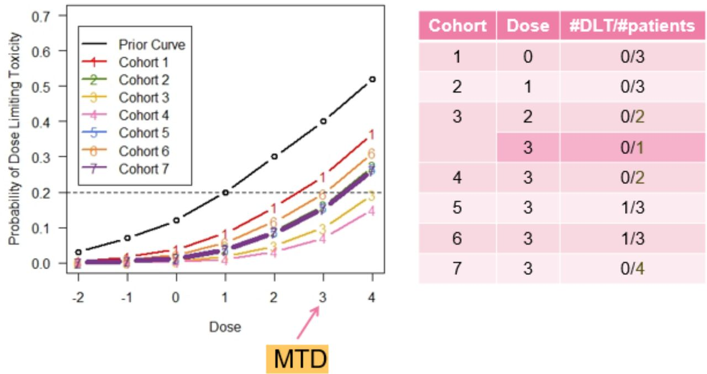{fig-align="center" width=75%} -->

## Phase I trials: Sample size calculation

-   No explicit sample size calculation
-   Can pre-specify via simulations
-   Usually 20-40 patients to ensure decent model fit

## Phase I trials: Analysis

-   Descriptive statistics

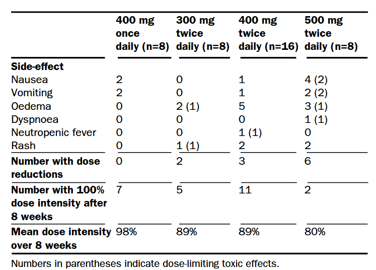{fig-align="center" width="70%"}

## Phase I trials: To sum up

-   [Example protocol template from clinicaltrials.gov](https://cdn.clinicaltrials.gov/documents/trainTrainer/Dose-Escalation-Design-Answer-Key.pdf?utm_source=chatgpt.com)
-   [MD Anderson BOIN design website for protocol template of the BOIN design](https://biostatistics.mdanderson.org/shinyapps/BOIN/)
-   Designing Dose-Finding Phase I Clinical Trials: Top 10 Questions That Should Be Considered

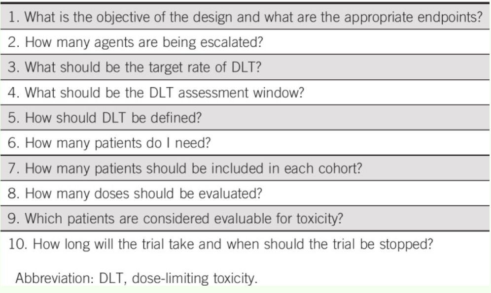{fig-align="center" width="70%"}

## Phase II trials: Aim

Further confirm safety of the recommended dose

-   Safety outcome like DLT still closely monitored

Investigate efficacy

-   Whether promising enough to initiate a large-scale Phase III investigation

## Phase II trials: Outcome

### Primary efficacy outcome

-   Objective tumor response (yes/no, binary) (Response Evaluation Criteria in Solid Tumors (RECIST))
-   For immuno-/targeted therapies, there's [findings](https://jamanetwork.com/journals/jamaoncology/fullarticle/2673078) that objective tumor response rate correlated poorly with overall survival
    -   Progression-free survival as a closer surrogate for overall survival

We'll focus on objective tumor response outcome in Phase II and discuss survival outcomes in Phase III

## Phase II trials: Design

Single-arm trial is a common design in oncology

-   Rational
    -   Easier and faster to initiate than a randomized controlled trial
    -   Already lots of data on the performance of the standard of care
    -   Patients' unwillingness to be randomized to standard of care.
    -   [Single-arm clinical trials: design, ethics, principles](https://spcare.bmj.com/content/15/1/46)
-   Caveat
    -   Prone to bias without randomization (confounders, selection bias)
    -   Not blinded

## Phase II trials: Sample size calculation

### A refresher of two types of mistakes

-   We can be wrong about the conclusion
-   Statistical procedures: we're not making mistakes too often (on average)

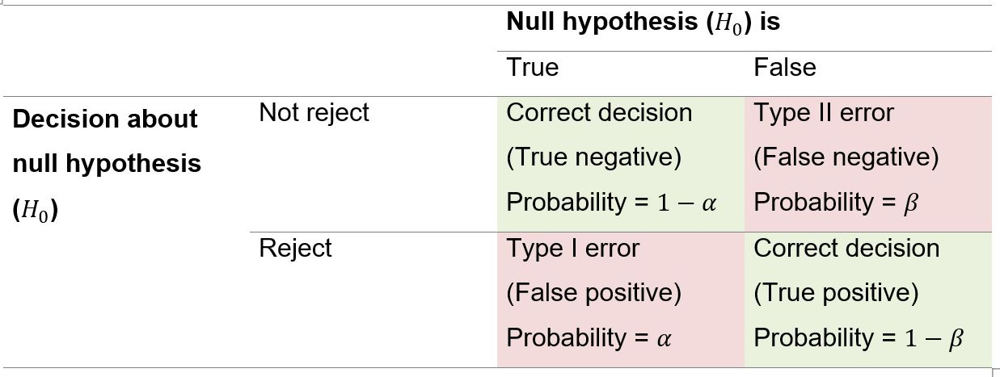{fig-align="center"}

## Phase II trials: Sample size calculation

### Why do sample size calculation?

Sample size calculation is to balance type I error, power, and the size of the effect

-   Type I error: We do not want to investigate further if the treatment is not working (often we control Type I error at $5\%$)
-   Power: If the treatment really works, we want to have high chance of finding this out (often we target $80\%$ power)
-   Effect size: The effect you won't want to miss
    -   Minimum clinically meaningful effect
    -   Not the true effect because we don't know it before the study

## Phase II trials: Sample size calculation

### An example with binary outcomes

[Phase II, single-arm trial of preoperative short-course radiotherapy followed by chemotherapy and camrelizumab in locally advanced rectal cancer](https://pmc.ncbi.nlm.nih.gov/articles/PMC8562535/#s2)

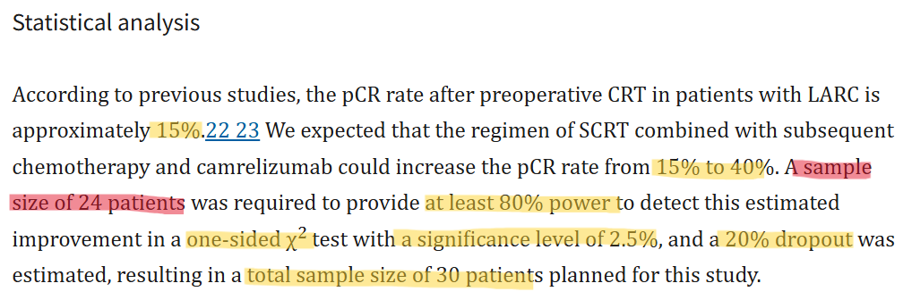{fig-align="center" width="100%"}

## Phase II trials: Sample size calculation

### An example with binary outcomes

[Sample size calculator for binary outcomes](https://biostatistics.mdanderson.org/shinyapps/Nbinary/)

-   They actually did for one-sided test with significance level 5% instead of 2.5%

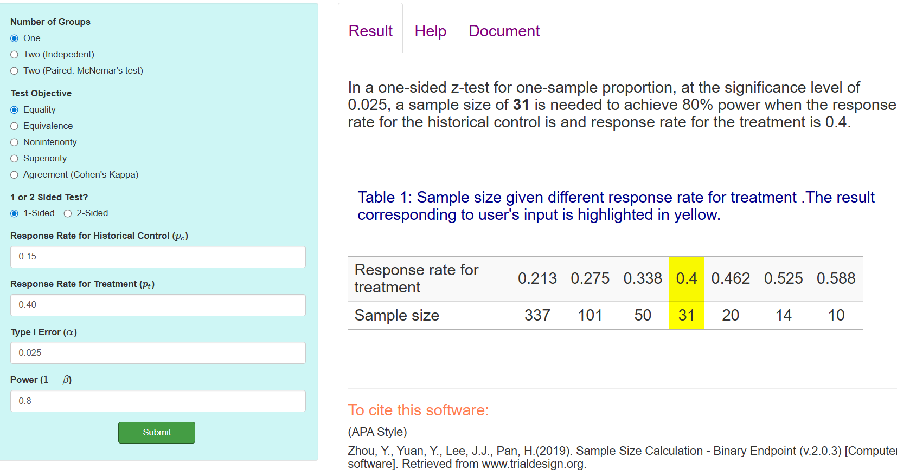{fig-align="center" width="90%"}

## Phase II trials: Sample size calculation

### An example with binary outcomes

-   A two-sided test looks for effects in both directions
    -   Puts half of the alpha for positive effect and the other half for negative effects
    -   It is the same as a one-sided test with half of the type I error
-   If this sounds confusing -- Always do a two-sided test with $5\%$ type I error

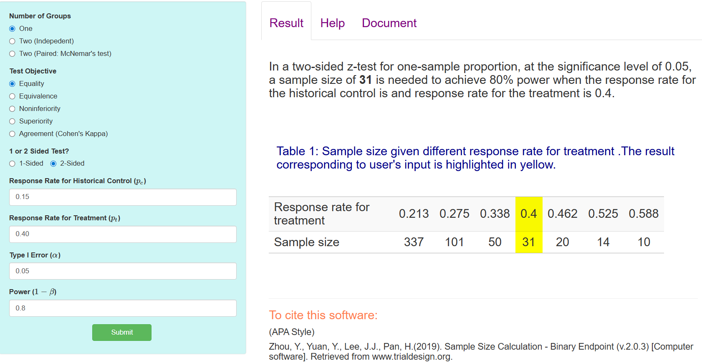{fig-align="center" width="80%"}

## Phase II trials: Analysis

### Binary outcomes

-   Data is often summarized in a 2-by-2 table (randomized controlled design) or one response rate (single-arm design)
-   The null hypothesis of no treatment effect is often tested via
    -   Chi-square test
-   The treatment effect is often quantified by
    -   Response rate (single-arm design)
    -   Risk ratio, odds ratio
    -   Adjusted odds ratio (for baseline prognostic covariates) via logistic regression

## Phase III trials: Aim & Design

-   Establish efficacy
    -   Large scale
-   Provide evidence for approval
    -   Minimize bias
    -   Often randomized controlled design with a concurrent standard of care arm

## Phase III trials: Outcome

### Primary efficacy outcome

-   Overall survival (OS)
    -   Sometimes trial based on progression-free survival (PFS) can receive accelerated approval, but later follow-up on OS is required
-   OS and PFS are *time-to-event* outcomes
    -   Previously when we consider tumor response, "snapshot", whether the event of interest happens
    -   With time-to-event outcomes, we are interested in how fast the event of interest happens

## Phase III trials: A primer on survival analysis

### Hazard (rate)

-   Informally, how quickly patients experience the event of interest (death, relapse, clearance of lesion).

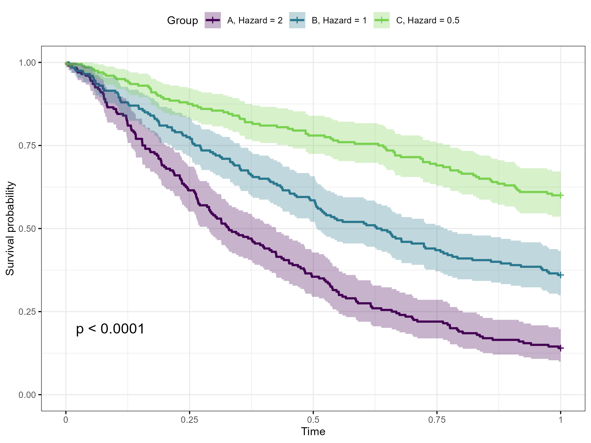{fig-align="center" width="65%"}

```{r,echo=FALSE,eval=FALSE}
#| fig-height: 5
#| fig-width: 7
#| fig-align: center
# show the effect of varying hazard
lambdas <- c(0.5,1,2)
    Surv.fun <- function(lambda,x)
    {
      exp(-lambda*x)
    }
    S1 <- function(x) {Surv.fun(lambda = lambdas[1],x=x)}
    S2 <- function(x) {Surv.fun(lambda = lambdas[2],x=x)}
    S3 <- function(x) {Surv.fun(lambda = lambdas[3],x=x)}
    #S4 <- function(x) {Surv.fun(lambda = lambdas[4],x=x)}
    ggplot(data=data.frame(x = seq(0, 1, by=0.01)), mapping = aes(x=x))+
      geom_function(fun=S1,aes(color=mycolors["myblue2"]),linewidth=1)+
      geom_function(fun=S2,aes(color=mycolors["mygreen2"]),linewidth=1)+
      geom_function(fun=S3,aes(color=mycolors["myyellow"]),linewidth=1)+
     # geom_function(fun=S4,aes(color=mycolors["myred"]),linewidth=1)+
      theme_minimal()+
      xlim(c(0,4))+
      ylim(c(0,1))+
      labs(x="Time (years)",y="Survival Probability",color="Hazard",
           title = "Hypothetical survival probabilties from an exponential distribution")+
      scale_color_manual(values = c("#67a8cd","#6fb3a8","#ffc17f"),labels=lambdas)+
      theme(
        legend.position = "top"
      )
```

```{r}
set.seed(123)
# hazard of control
lambdaA <- 2
# hazard of treatment
lambdaB <- 1
lambdaC <- 0.5
# administrative censoring
ac <- 1
# sample size 100, equal randomization
N <- 200
# inverse of the cumulative density function of the exponential
F.inv <- function(x,lambda)
{
  log(1-x)/(-lambda)
}
uuA <-  runif(n=N)
failure.times.A <- F.inv(x=uuA,lambda = lambdaA)
uuB <-  runif(n=N)
failure.times.B <- F.inv(x=uuB,lambda = lambdaB)
uuC <-  runif(n=N)
failure.times.C <- F.inv(x=uuC,lambda = lambdaC)
event.times <- c(failure.times.A,failure.times.B,failure.times.C)
event.times[event.times>=ac] <- ac
event <- rep(1,3*N)
event[event.times>=ac] <- 0
df <- data.frame(
  id = 1:(3*N),
  group = rep(c("A","B","C"),each=N),
  time = event.times,
  event = event
)
# plot KM curve
fit<- survfit(Surv(time, event) ~ group, data = df)
p <- ggsurvplot(fit, data = df,
#surv.median.line = "hv", # Add medians survival
 # Change legends: title & labels
 legend.title = "Group",
 legend.labs = c("A, Hazard = 2", "B, Hazard = 1","C, Hazard = 0.5"),
 # Add p-value and tervals
 pval = TRUE,
 conf.int = TRUE,
 # Add risk table
 risk.table = TRUE,
 tables.height = 0.2,
 tables.theme = theme_cleantable(),
 # Color palettes. Use custom color: c("#E7B800", "#2E9FDF"),
 # or brewer color (e.g.: "Dark2"), or ggsci color (e.g.: "jco")
 palette = c("#67a8cd","#6fb3a8","#ffc17f"),
 ggtheme = theme_bw())+
  labs(x="Time")
ggsave(file="plots/hazard.png",plot = p$plot,units = "in",
       width=8,height = 6)
```

## Phase III trials: A primer on survival analysis

### Hazard ratio

-   The ratio of two hazards between two groups
-   Compares the "rate of per unit time" of having the event of interest that applies to every short time interval
    -   For instance, HR=2 means that at each day the probability of the event is two times higher in one group compared to the other group.
-   Hazard ratio is a relative measure rather than an absolute measure
    -   Group comparisons with the same hazard ratio can have very different survival curves

------------------------------------------------------------------------

A hazard ratio of 0.5 of treatment vs. control, but both poor survival

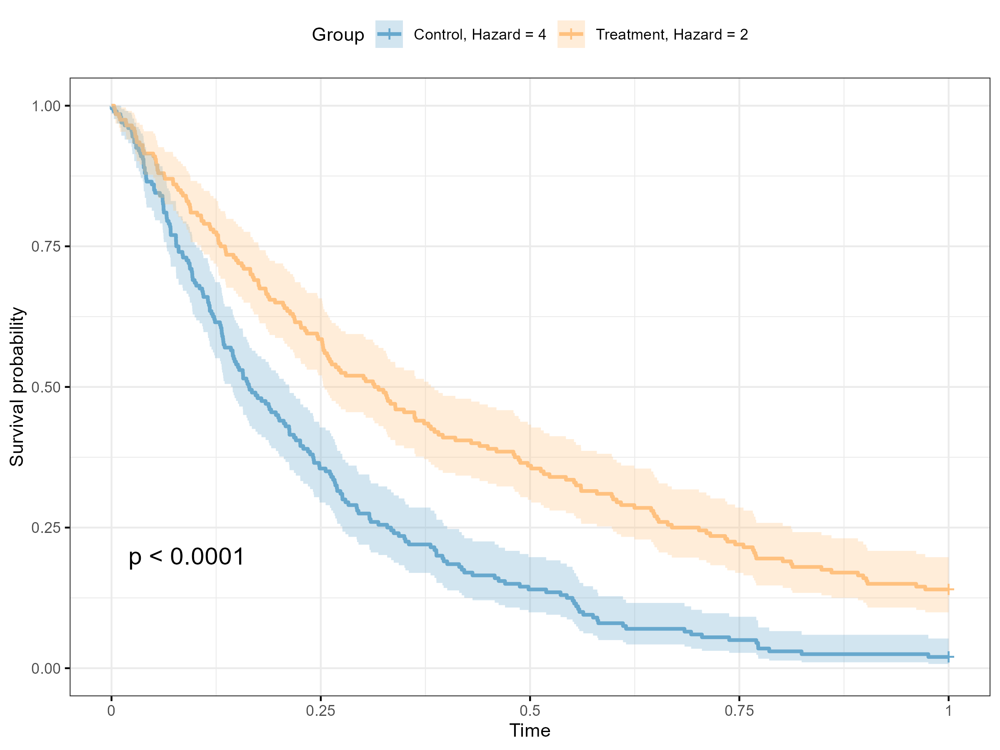{fig-align="center" width="80%"}

```{r,echo=FALSE,eval=FALSE}
set.seed(123)
# hazard of control
lambdaA <- 4
# hazard of treatment
lambdaB <- 2
# administrative censoring
ac <- 1
# sample size 100, equal randomization
N <- 200
# inverse of the cumulative density function of the exponential
F.inv <- function(x,lambda)
{
  log(1-x)/(-lambda)
}
uuA <-  runif(n=N)
failure.times.A <- F.inv(x=uuA,lambda = lambdaA)
uuB <-  runif(n=N)
failure.times.B <- F.inv(x=uuB,lambda = lambdaB)
event.times <- c(failure.times.A,failure.times.B)
event.times[event.times>=ac] <- ac
event <- rep(1,2*N)
event[event.times>=ac] <- 0
df <- data.frame(
  id = 1:(2*N),
  group = rep(c("Control","Treatment"),each=N),
  time = event.times,
  event = event
)
# plot KM curve
fit<- survfit(Surv(time, event) ~ group, data = df)
p <- ggsurvplot(fit, data = df,
#surv.median.line = "hv", # Add medians survival
 # Change legends: title & labels
 legend.title = "Group",
 legend.labs = c("Control, Hazard = 4", "Treatment, Hazard = 2"),
 # Add p-value and tervals
 pval = TRUE,
 conf.int = TRUE,
 # Add risk table
 # Color palettes. Use custom color: c("#E7B800", "#2E9FDF"),
 # or brewer color (e.g.: "Dark2"), or ggsci color (e.g.: "jco")
 palette = c("#67a8cd","#ffc17f"),
 ggtheme = theme_bw())+
  labs(x="Time")
ggsave(file="plots/HR1.png",plot = p$plot,units = "in",
       width=8,height = 6)
```

------------------------------------------------------------------------

A hazard ratio of 0.5 of treatment vs. control, both good survival

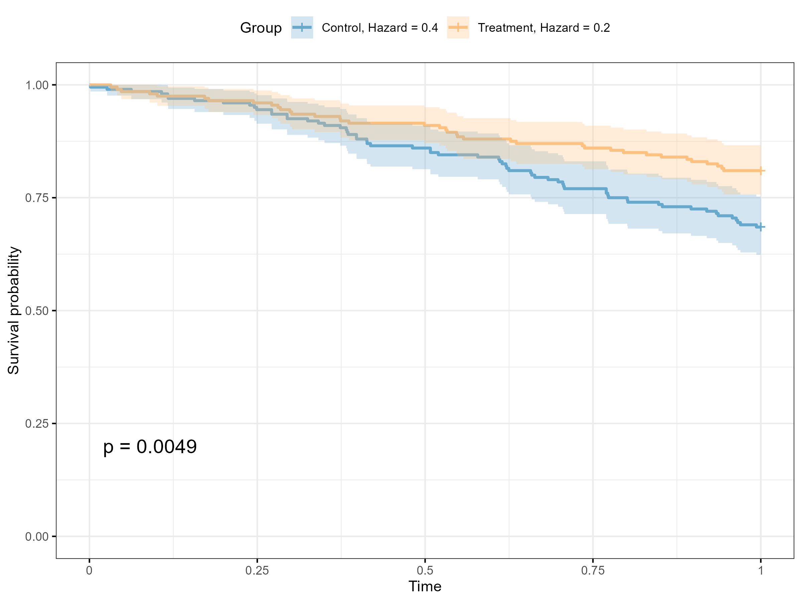{fig-align="center" width="80%"}

```{r,echo=FALSE,eval=FALSE}
set.seed(123)
# hazard of control
lambdaA <- 0.4
# hazard of treatment
lambdaB <- 0.2
# administrative censoring
ac <- 1
# sample size 100, equal randomization
N <- 200
# inverse of the cumulative density function of the exponential
F.inv <- function(x,lambda)
{
  log(1-x)/(-lambda)
}
uuA <-  runif(n=N)
failure.times.A <- F.inv(x=uuA,lambda = lambdaA)
uuB <-  runif(n=N)
failure.times.B <- F.inv(x=uuB,lambda = lambdaB)
event.times <- c(failure.times.A,failure.times.B)
event.times[event.times>=ac] <- ac
event <- rep(1,2*N)
event[event.times>=ac] <- 0
df <- data.frame(
  id = 1:(2*N),
  group = rep(c("Control","Treatment"),each=N),
  time = event.times,
  event = event
)
# plot KM curve
fit<- survfit(Surv(time, event) ~ group, data = df)
p <- ggsurvplot(fit, data = df,
#surv.median.line = "hv", # Add medians survival
 # Change legends: title & labels
 legend.title = "Group",
 legend.labs = c("Control, Hazard = 0.4", "Treatment, Hazard = 0.2"),
 # Add p-value and tervals
 pval = TRUE,
 conf.int = TRUE,
 # Add risk table
 # Color palettes. Use custom color: c("#E7B800", "#2E9FDF"),
 # or brewer color (e.g.: "Dark2"), or ggsci color (e.g.: "jco")
 palette = c("#67a8cd","#ffc17f"),
 ggtheme = theme_bw())+
  labs(x="Time")
ggsave(file="plots/HR2.png",plot = p$plot,units = "in",
       width=8,height = 6)
```

## Phase III trials: A primer on survival analysis

### (Right) Censoring

-   It takes time to observe time
-   Censoring occurs when true event time is longer than the observed time
    -   Fixed study period, administrative censoring (case E), most common in trial setting
    -   Loss to follow-up (case A)
    -   Withdraw for other reasons (case C)

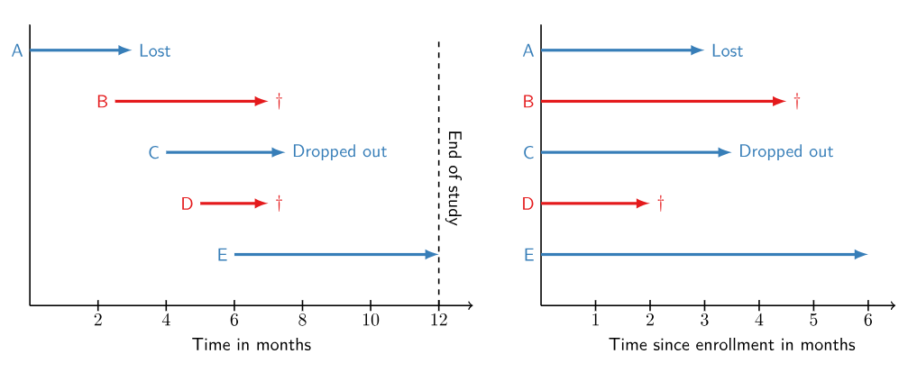{fig-align="center" width="80%"}

```{r,echo=FALSE,eval=FALSE}
set.seed(123)
# hazard of control
lambda0 <- 1
# hazard of treatment
lambda1 <- 0.6
lambda.c.vec <- c(0,0.6,1.2,2) # censoring rate
# administrative censoring
ac <- 2 # at two years
# sample size 100, equal randomization
N <- 400
# inverse of the cumulative density function of the exponential
F.inv <- function(x,lambda)
{
  log(1-x)/(-lambda)
}
# visualize a subset of samples
survplot.list <- vector(mode = "list",length = nsim)
# keep failure time fixed
uu0 <-  runif(n=N/2)
failure.times.0 <- F.inv(x=uu0,lambda = lambda0)
uu1 <-  runif(n=N/2)
failure.times.1 <- F.inv(x=uu1,lambda = lambda1)
failure.times <- c(failure.times.0,failure.times.1)
cc <- runif(n=N)
for(i in 1:length(lambda.c.vec))
{
lambda.c <- lambda.c.vec[i]
censor.times <- F.inv(x=cc,lambda = lambda.c)
event.times <- pmin(failure.times,censor.times)
event <- as.integer(failure.times < censor.times)
event.times[event.times>=ac] <- ac
event[event.times>=ac] <- 0
df <- data.frame(
  id = 1:N,
  group = rep(c(0,1),each=N/2),
  time = event.times,
  event = event
)

# plot KM curve
fit<- survfit(Surv(time, event) ~ group, data = df)
cox <- coxph(Surv(time,event)~group,data=df,ties = "breslow")
hat.hr <- summary(cox)$coefficients[2]
hr.ci <- exp(confint(cox))
survplot <- ggsurvplot(fit, data = df,
#surv.median.line = "hv", # Add medians survival
 # Change legends: title & labels
 legend.title = "Group",
 legend.labs = c("Control", "Intervention"),
 # Add p-value and tervals
 pval = TRUE,
 conf.int = TRUE,
 # Add risk table
 risk.table = TRUE,
 tables.height = 0.2,
 tables.theme = theme_cleantable(),
 # Color palettes. Use custom color: c("#E7B800", "#2E9FDF"),
 # or brewer color (e.g.: "Dark2"), or ggsci color (e.g.: "jco")
 palette = c("#67a8cd", "#f36569" ),
 ggtheme = theme_bw())+
  labs(x="Time (years)")
survplot.list[[i]] <- survplot$plot +
  annotate("text",x=1.2,y=0.8,label=paste0("Estimated HR = ",
                                           round(hat.hr,2),
                                           " (",
                                           round(hr.ci[1],2),
                                           ", ",
                                           round(hr.ci[2],2),")"),
           color="#f36569",size=3.5)
}
#survplot.list[[2]]
plot1 <- ggarrange(plotlist = survplot.list,
          ncol=2, nrow=2,
          common.legend = TRUE)
ggsave(file="plots/censoring_noninfo.png",plot = plot1,units = "in",
       width=8,height = 6)
```

## Phase III trials: Sample size calculation

### An example with time-to-event outcome

Sample size for time-to-event outcomes is really about the number of *events*, not just the number of patients

Sample size for time-to-event outcomes depends on

-   

    1.  How much error we tolerate

    -   Type I error, Power

------------------------------------------------------------------------

Sample size for time-to-event outcomes depends on

-   

    2.  Effect size

    -   Improvement on median OS, Hazard ratio

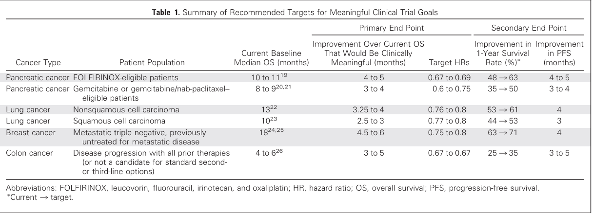{fig-align="center" width="110%"}

------------------------------------------------------------------------

Sample size for time-to-event outcomes depends on

-   

    3.  The hazard of event under current standard of care

    -   If no patient from either of the treatment arm experiences the event of interest during the whole follow-up, the we can't tell which treatment is better

------------------------------------------------------------------------

Sample size for time-to-event outcomes depends on

-   

    4.  Censoring

    -   How fast patients "disappear" from the trial
    -   Often due to difficulty in patient accrual
    -   Patients entering later will have a shorter period of follow-up

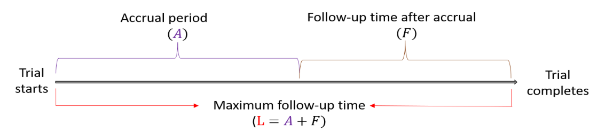{fig-align="center" width="110%"}

------------------------------------------------------------------------

Sample size for time-to-event outcomes depends on

-   

    5.  Allocation ratio

    -   1:1 allocation is statistically most efficient
    -   But patients may want higher chance of being randomized to the new intervention

## Phase III trials: Sample size calculation

### An example with time-to-event outcome

[Adjuvant chemotherapy with or without bevacizumab in patients with resected non-small-cell lung cancer (E1505) an open-label, multicentre, randomised, phase 3 trial](https://www.thelancet.com/journals/lanonc/article/PIIS1470-2045(17)30691-5/fulltext)

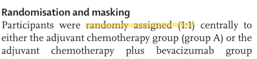{fig-align="center" width="36%"}

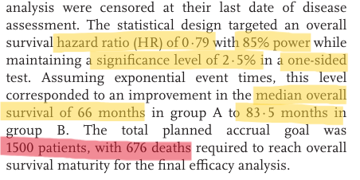{fig-align="center" width="36%"}

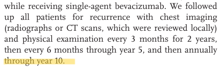{fig-align="center" width="36%"}

## Phase III trials: Sample size calculation

### An example with time-to-event outcome

[Sample size calculator for time-to-event outcomes](https://biostatistics.mdanderson.org/shinyapps/Nsurvival/)

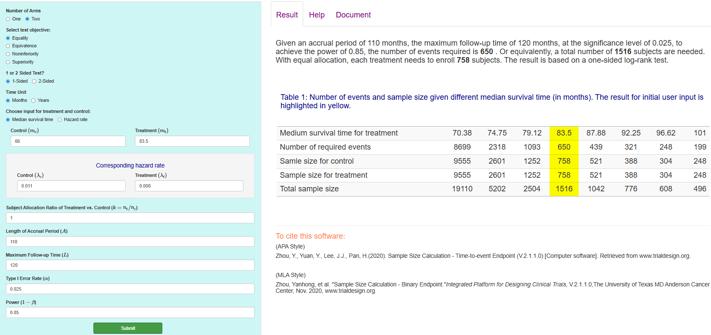{fig-align="center" width="100%"}

## Phase III trials: Analysis

### Time-to-event outcomes

-   Survival probability over time is usually estimated using the Kaplan-Meier curve
-   The null hypothesis of no treatment effect (i.e., the two groups have exact the same survival curves) is often tested via
    -   log-rank test
-   The treatment effect is often quantified by
    -   (Adjusted) hazard ratio (for baseline prognostic covariates) via Cox regression

## Phase III trials: Analysis

### When the proportional hazard does not hold (?)

-   Pre-specify the analysis time-point to avoid p-hacking
    -   5-year/10-year hazard ratio

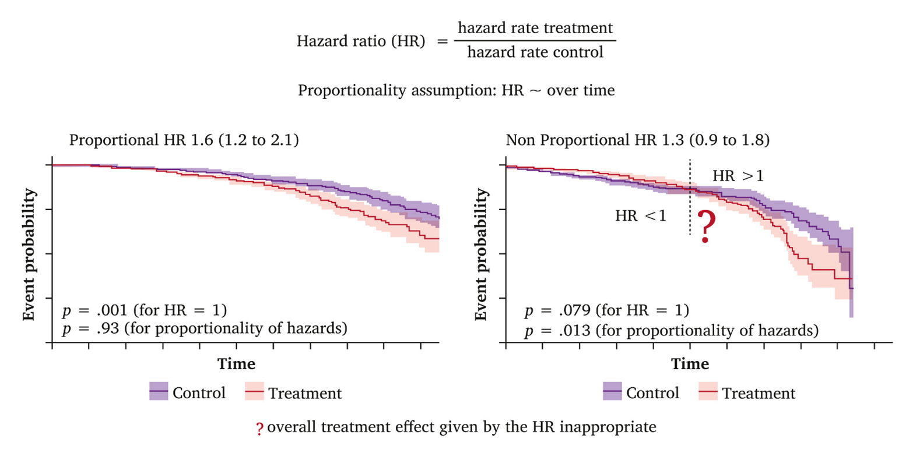{fig-align="center" width="100%"}

## Relevant topics: More on censoring

### Non-informative vs. informative censoring

-   Non-informative censoring: being censored gives no information about the actual risk of the event
    -   Administrative censoring is non-informative
    -   Loss-to-follow-up due to moving is usually non-informative
-   Non-informative censoring does not introduce bias, but adds more uncertainty due to less information

------------------------------------------------------------------------

### Different extent of non-informative censoring

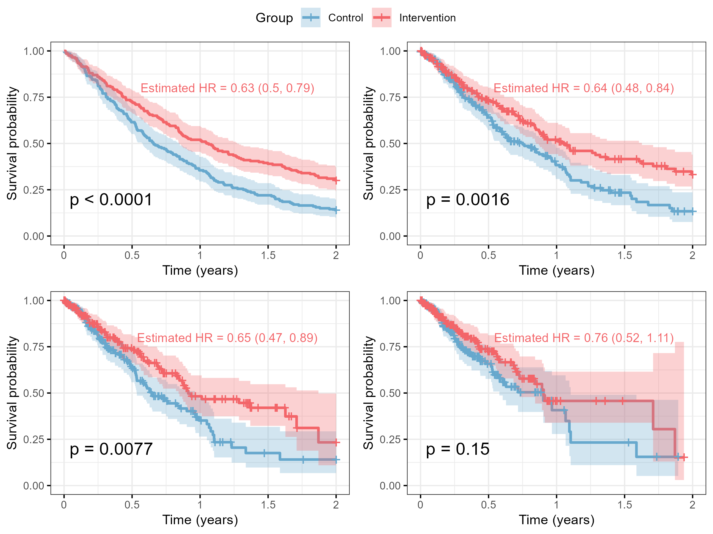{fig-align="center" width="80%"}

## Relevant topics: More on censoring

### Non-informative vs. informative censoring

-   Informative censoring: being censored is related to the actual risk of the event
-   Example: The Bolero-2 study
    -   Patients on the intervention arm can not tolerate the excess toxicity so they withdraw
    -   Censoring them is *Informative*, will bias the treatment effect (which direction?)

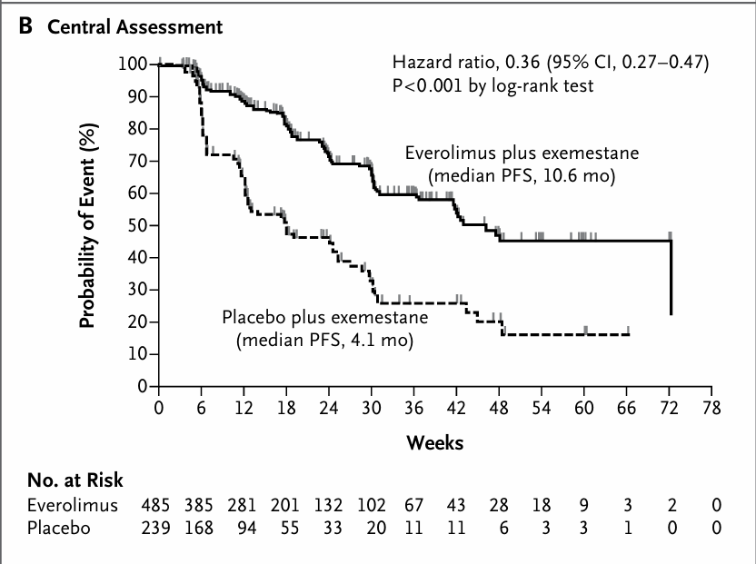{fig-align="center" width="55%"}

------------------------------------------------------------------------

### Informative censoring

-   Prevent it at the design stage (best option)
    -   Minimize dropouts with good follow-up, reminders, incentives
-   Statistical adjustment (e.g., Inverse probability of censoring weighting)

## Relevant topics: Multiple testing

### The fixed "alpha budget"

-   In clinical trials, we set a maximum tolerace of a false positive (Type I error), usually $5\%$ ($\alpha = 0.05$)
-   This is the "alpha budget."
-   Usually is reserved for testing the main treatment effect on the primary endpoint.
-   If we start testing multiple things with the same budget, the chance of at least one false positive increases, unless we control for it

## Relevant topics: Multiple testing

### Interim analysis

-   Perhaps you want to peek at your trial data before the planned sample size, to stop earlier for efficacy
-   Every interim analysis consumes a bit of the alpha budget
-   There are alpha spending functions (e.g., O'Brien-Fleming, Pocock rule) to help you design such interim analyses
    -   At the end of the trial, you might not able to reject the null even if your p value is \< 0.05

## Relevant topics: Multiple testing

### Co-primary outcomes

-   Perhaps you think two (or more) outcome measures are equally meaningful so you want to make them co-primary
-   The alpha budget has to be split across them
    -   Bonferroni correction (testing at half of the alpha level for both)
    -   Hierarchical testing (test first outcome at level alpha, if significant, can "gain back" the alpha and test the second outcome still at level alpha)

## Relevant topics: Multiple testing

### Subgroup analysis

-   Trials are powered (sample size calculated) for the overall primary outcome, not for subgroups
-   Subgroups (e.g., "effect in women only" or "patients over 65") have smaller sample sizes, so less power
-   Subgroup analyses are usually exploratory, unless pre-specified with formal adjustments

## Relevant topics: Non-inferiority trials

-   Most trials in oncology test equality of treatment effects
    -   Null hypothesis: there is no treatment effect
-   Non-inferiority trials aim to show that the new treatment is not unacceptably worse than the control by more than a pre-specified margin, $\delta$
    -   Null hypothesis: new treatment is worse than control by more than $\delta$
    -   e.g., show that that an oral therapy is not more than $10\%$ worse than IV therapy in survival, but with fewer side effects.
-   Why non-inferiority trials?
    -   The new treatment might have some benefits other than efficacy
    -   Less toxic, cheaper, easier to comply

## Relevant topics: Non-inferiority trials

But non-inferiority trials are hard to conduct

-   Has to choose the non-inferiority margin
    -   If too wide, risk approving for an inferior treatment. If too narrow, the trial may not be feasible
-   Usually much larger sample size requirements

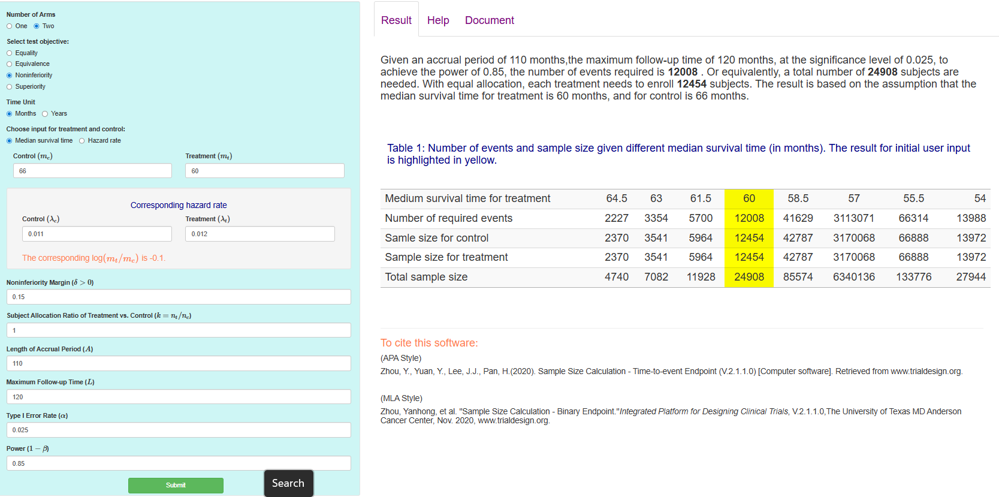{fig-align="center" width="80%"}
